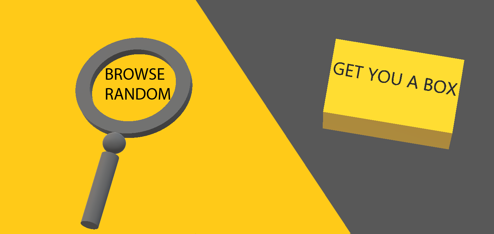
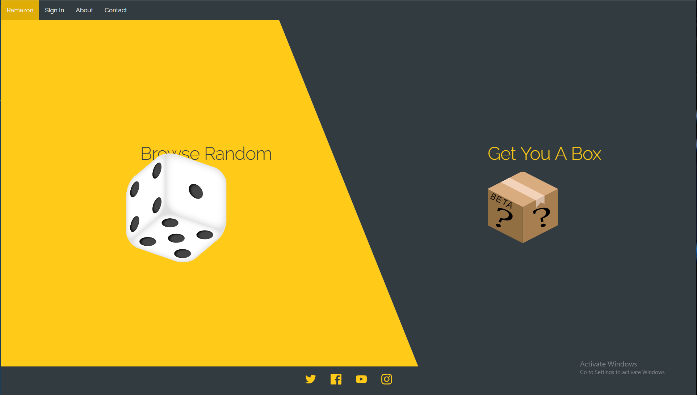

|     | #Ramazon |     |
| --- | :------: | --: |

# Changelog

- Added css modules support in web pack
- Removed materialize in favor of skeleton css (will be writing mostly custom modular styles anyway)
- created v2 Branch because I wasn't ballsy enough to remove everything I did last year even though it's mostly illegible

# Templates

Minimalist:

Result:

# To Do

- Style Browse
- Create purchase flow
- Create contact page
- Create about page
- Sign in page?
